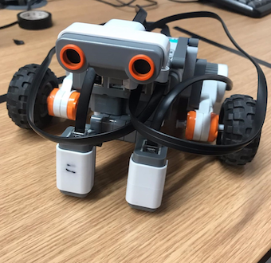
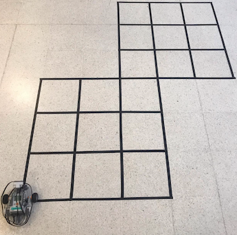

# Mobile Robotics: Lego NTX

## Introduction
Robotics developed so far has achieved great success in the world of industrial manufacturing and scientific exploring. One of the most famous and common application are or manipulators which can move with high speed and accuracy, however, are highly specialised and immobile. 

Mobile robots are expected to move freely within the environment and interpret it which significantly increases their potential and efficiency. To navigate safely, they are required to recognize landmarks and objects as well as avoid obstacles. This project aims to provide an implementation of a mobile robot capable of sensing the environment, navigating it and performing actions based on the captured and processed data.
   

## Lego NTX
The robot used in this project is a prebuilt automaton with extendible components based on Lego NXT platform. Use of this hardware enabled component modularity and a use of well-documented Java API to program its behaviour - leJOS. The components include:
| **Module**        | Description   |
| -                 | -             |
| **Body**          | The main component of the robot that includes the processing unit, a display screen, components ports, buttons for basic control of the robot, and a USB port that enables to transfer compiled code from a computer to the robot for execution |
| **Motors**        | Two motors, each controlling one wheel of the robot, connected to the body using an output port. Among other features, the programmer can set the speed and direction of each motor |
| **Sonar**         | One sonar sensor connected to the body using an input port. The main functionality of this component is measuring the distance to the closest object detectable by the sonar |
| **Light sensor**  | Two light sensors connected to the body using input ports. Each of them is capable of returning the light intensity. To increase measurement accuracy, sensors have a built-in LED (flood light) which emits additional light which reflected luminosity can be sampled |

   

## Project's aim

The problem faced by the robot is called ”Grid World”. The goal is to explore a grid consisting of black square cells by transitioning the robot along the lines. The device had to account for any obstacles and variances in terms of dimensions. The assumption of a static world was adopted, hence, no modifications to the gird and obstacles could occur throughout the state space exploration. The ultimate aim is to find the shortest path from the starting state in the bottom right corner to the final state in the top right corner.

   

## Contents
The software developed to complete the problem was divided into four Java classes:
| **File**          | Description   |
| -                 | -             |
| **MazeRunner**    | The main class that implements the DFS, instantiates all classes with sampled prior parameters and handles their synchronised execution |
| **Grid**          | The class that handles the set of explored nodes, where each node is a unique junction (or corner) of the grid. It also implements the shortest path finding algorithm between any two explored nodes and it stores a set detected obstacles |
| **Robot**         | The class which manages any sensory measurements (obstacles and light values), as well as the robot’s movement |
| **Node**          | The class that is used to represent a single node of the grid. The main function of the object is to provide a list of neighbours (can be visited or unvisited) of that junction |

For further detail see `report.pdf` and files located in the `src/` directory.